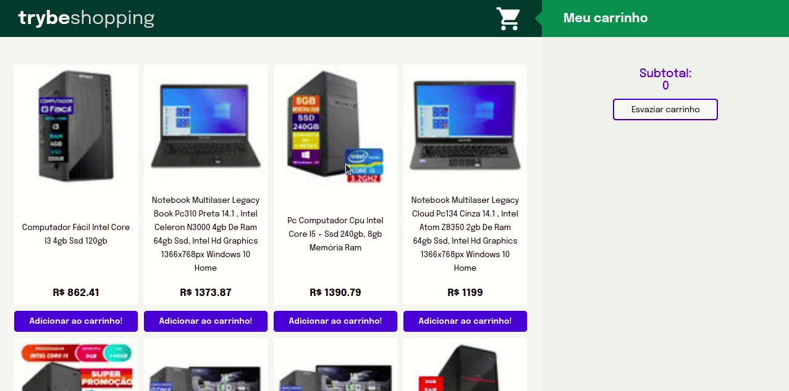

# Boas-vindas ao repositório do projeto Carrinho de Compras!

Projeto desenvolvido no curso da Trybe ao final do bloco 9* do Módulo 2 - Desenvolvimento Front-end.  
<strong>Bloco 9: JavaScript e Testes Assíncronos</strong> 
9.1.1 - Introdução - Front-end 
9.1.2 - JavaScript Assíncrono e Callbacks 
9.2 - JavaScript Assíncrono - Fetch API e async/await 
9.3 - Jest - Testes Assíncronos 
9.3 - Projeto - Carrinho de Compras 

No projeto <strong>Carrinho de Compras</strong> foi desenvolvido uma página que apresenta várias opções de computadores que podem ser acrescentados ao carrinho de compra o qual irá mostrar o preço total dos itens selecionados. Para retirar algum item do carrinho é só clicar nele ou clicar em esvaziar carrinho, para retirar todos os itens. Também foi desenvolvido os testes assíncronos do projeto.

